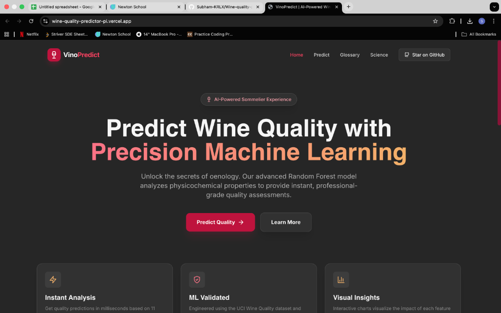
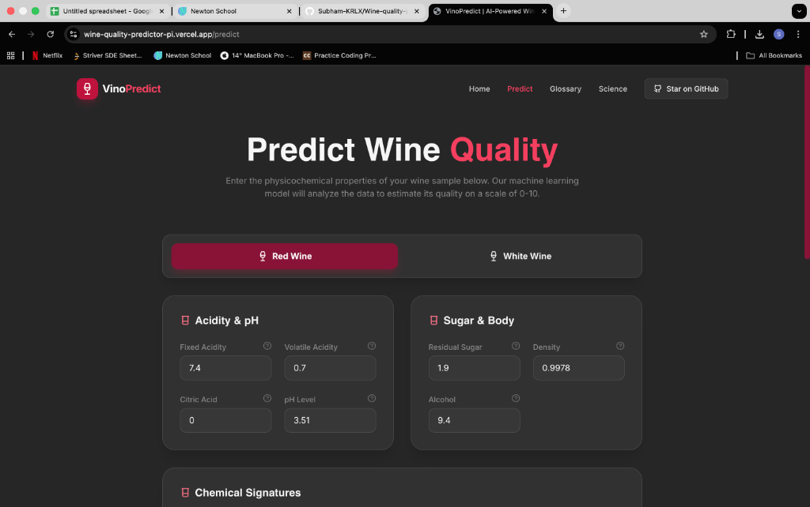
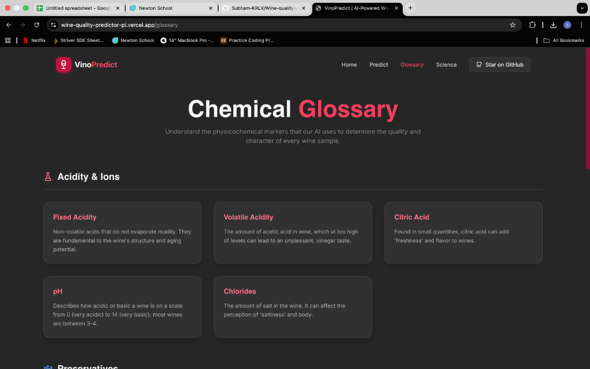
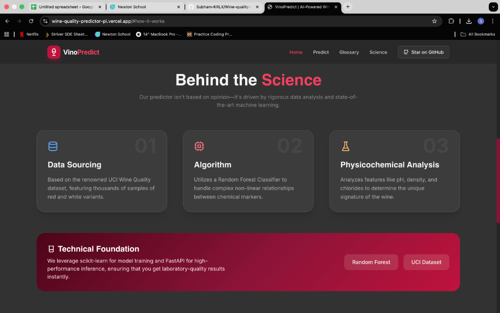

# 🍷 VinoPredict: AI-Powered Wine Quality Analysis

[](https://wine-quality-predictor-pi.vercel.app)
[](https://wine-quality-backend.onrender.com/docs)
[](https://opensource.org/licenses/MIT)

A sophisticated full-stack machine learning application designed to predict wine quality using advanced physicochemical analysis. VinoPredict leverages state-of-the-art machine learning to provide instant, professional-grade quality assessments.
---

## 📸 Application Preview

<p align="center">
  
  
</p>
<p align="center">
  
  
</p>

---

## ✨ Features

- **🎯 Precision ML Prediction**: Instantly analyze wine quality based on 11 physicochemical properties.
- **📚 Chemical Glossary**: Interactive guide to understanding the impact of pH, acidity, and alcohol levels.
- **🔬 Science-Driven**: Powered by a Random Forest Classifier trained on the renowned UCI Wine Quality dataset.
- **📱 Responsive Design**: Seamless experience across desktop and mobile devices.
- **⚡ Fast Inference**: High-performance backend providing results in milliseconds.

---

## 🛠️ Tech Stack

### Frontend
- **Framework**: [React](https://reactjs.org/) + [Vite](https://vitejs.dev/)
- **Styling**: [TailwindCSS](https://tailwindcss.com/)
- **State Management**: React Hooks
- **Deployment**: Vercel

### Backend
- **Framework**: [FastAPI](https://fastapi.tiangolo.com/) (Python)
- **ML Engine**: Scikit-Learn
- **Inference**: Random Forest Classification
- **Deployment**: Render

### Machine Learning
- **Dataset**: UCI Wine Quality (Red & White variants)
- **Preprocessing**: Pandas, NumPy
- **Model Storage**: Joblib

---

## 📂 Project Structure

```text
Wine-quality-predictor-
├── backend/            # FastAPI Application
│   ├── app/            # Main server logic
│   └── models/         # Serialized ML models
├── frontend/           # Vite + React UI
│   ├── src/            # Components & Styles
│   └── public/         # Static assets
├── ml_pipeline/        # Model training scripts
├── docs/               # Documentation & Screenshots
└── docker-compose.yml  # Container orchestration
```

---

## 🚀 Local Development Setup

### 1. Backend Setup

```bash
# Navigate to root directory
python -m venv venv
source venv/bin/activate  # On Windows: venv\Scripts\activate

# Install dependencies
pip install -r requirements.txt

# Train the model (Required for first run)
python ml_pipeline/train_model.py

# Start the server
uvicorn backend.app.main:app --reload
```
The API will be available at `http://localhost:8000`.

### 2. Frontend Setup

```bash
cd frontend

# Install dependencies
npm install

# Start development server
npm run dev
```
The application will be available at `http://localhost:5173`.

### 3. Docker (Optional)

```bash
docker-compose up --build
```

---

## 📄 License

This project is licensed under the MIT License - see the [LICENSE](LICENSE) file for details.

## 🙏 Acknowledgments

- UCI Machine Learning Repository for the [Wine Quality Dataset](https://archive.ics.uci.edu/ml/datasets/wine+quality).
- All contributors and open-source packages that made this project possible.

